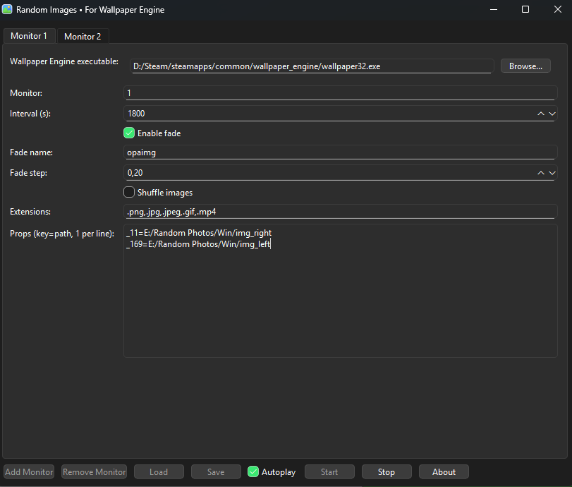

# Random Images • For Wallpaper Engine


A utility developed in **Python + PySide6** that automates switching images and videos in **Wallpaper Engine**.  
It was created for those who use Wallpaper Engine but don’t want to be stuck with a single set of static images or manually change wallpapers.

The program allows configuring multiple monitors, rotating images/videos at defined intervals, applying *fade* effects for smoother transitions, and saving configurations for later use.

---

## ✨ Features

- Multi-monitor support.  
- Accepts images (`.png`, `.jpg`, `.jpeg`, `.gif`, `.bmp`) and videos (`.mp4`).  
- Automatic switching at configurable intervals.  
- **Shuffle** option to randomize the image order.  
- *Fade in/out* effect for smooth transitions (when supported by the wallpaper).  
- System tray icon to run in the background.  
- Persistent JSON configurations, easy to save and load.  

---

## 📦 Installation

### Option 1: Using the executable (.exe)

1. [Download the executable from the Releases section](https://github.com/jrcn1991/app_random_images_for_wallpaper_engine/releases/latest).  
2. Place the executable in any folder of your choice (the app is portable).  
3. Double-click to start.  
4. If you want it to run with Windows, manually add it to the **Startup** folder or configure it via Task Scheduler.  

### Option 2: Running from source code (Python)

1. Install Python 3.9+ on Windows.  
2. Install dependencies:  
   ```bash
   pip install PySide6
   ```
3. Run the main script:  
   ```bash
   python wallpaper_engine_trocar_img_app.py
   ```

---

## 🚀 Structure and Usage

### 1. Add monitor
- Click **Add Monitor** to include a new monitor.  
- Enter the monitor number according to the Windows configuration (e.g., `1`, `2`, etc.).  

### 2. Main fields

| Field                           | Detailed description                                                                                                                                 |
|--------------------------------|-------------------------------------------------------------------------------------------------------------------------------------------------------|
| **Wallpaper Engine executable** | Path to `wallpaper32.exe` or `wallpaper64.exe`, located in the Wallpaper Engine installation folder.                                                   |
| **Monitor**                     | Number of the monitor that will receive the wallpapers.                                                                                              |
| **Interval (s)**                | Interval in seconds for automatic switching. Suggested default: `1800` (30 minutes).                                                                 |
| **Enable fade (Optional)**      | If enabled, activates fade effect. Only works if the wallpaper supports opacity for images.                                                           |
| **Fade name (Optional)**        | Name of the opacity property. Usually `opaimg`, but varies by wallpaper.                                                                              |
| **Fade step (Optional)**        | Increment used to smooth the fade. The smaller the value, the smoother and slower the transition.                                                      |
| **Shuffle images**              | Randomizes the order of images. If disabled, the app follows alphabetical order.                                                                      |
| **Extensions**                  | Accepted extensions. No need to change, already set with the most common formats.                                                                     |
| **Props (key=path)**            | List of Wallpaper Engine properties. You must specify the key used by the wallpaper and the folder path where the images you want to use are stored. |

#### Practical examples of **Props**
- Steam wallpaper: [Example 1](https://steamcommunity.com/sharedfiles/filedetails/?id=3426511645)  
  ```txt
  _11=E:/Random Photos/Win/img_right
  _169=E:/Random Photos/Win/img_left
  ```

- Another wallpaper: [Example 2](https://steamcommunity.com/sharedfiles/filedetails/?id=3332091404)  
  ```txt
  customimageleft=E:/Random Photos/Win2/img_left2
  customimageright=E:/Random Photos/Win2/img_right2
  ```

---

### 3. Main buttons
- **Start** → starts automatic wallpaper switching.  
- **Stop** → stops execution (applying final fade if enabled).  
- **Load / Save** → load or save your JSON configurations for future use.  
- **Autoplay** → starts the app directly in the background.  
- **About** → shows app information.  

---

## 🖼️ Interface and Demonstrations

### Main screen
  

### Real-time operation
*(Example with fade/shuffle disabled and 10s transition for demo purposes)*  
  

### Note about Fade effect
To use **fade**, the wallpaper must support opacity for images.  
  
- Go to the wallpaper settings in Wallpaper Engine.  
- If there is an individual opacity adjustment for images, it means fade is supported.  
- In this case, just identify the key in the wallpaper’s `project.json` and use it in `Fade name`.  

---

## 🔍 How to find Props keys

1. Go to the **Wallpaper Engine** folder and open the `config.json` file.  
2. Locate the `selectedwallpapers` section, which shows the path to the wallpaper’s `scene.json` or `scene.pkg` files.  
3. Open the wallpaper’s `project.json`.  
4. Inside, search for properties related to images. Example:  

```json
"_11": {
  "text": "Image (small)",
  "type": "scenetexture"
},
"_169": {
  "text": "Image (big)",
  "type": "scenetexture"
}
```

These keys (`_11` and `_169`) are the ones you should use in the **Props** field.

---

## 🛠️ Tips and Troubleshooting

- **Fade doesn’t work** → Check if the wallpaper really supports opacity adjustment for images.  
- **Nothing happens when clicking Start** → Make sure you entered the correct path to `wallpaper32.exe` or `wallpaper64.exe`.  
- **Images don’t load** → Check if the extensions are correct and if the paths in Props exist.  
- **Two monitors, but only one changes wallpaper** → Check if you configured both monitors separately in the app.  
- **Want to start with Windows** → Place the `.exe` inside the `shell:startup` folder or configure it in Task Scheduler.  

---

## ⚠️ Requirements

- Windows 10 or 11.  
- Wallpaper Engine running.  
- Python 3.9+ (only if running from source).  

---

## 👨‍💻 Author

**Rafael Neves**  
🌐 [rafaelneves.dev.br](https://rafaelneves.dev.br)  

---

## 📜 License

Distributed under the **MIT** license.  
You may freely use, modify, and share.  
